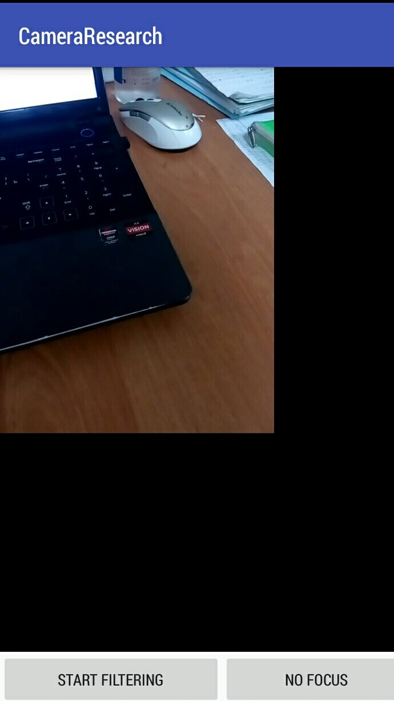
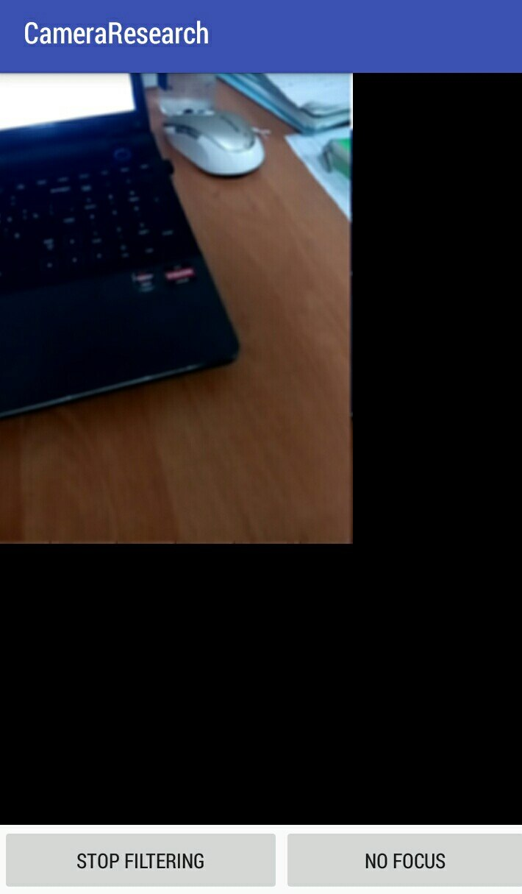
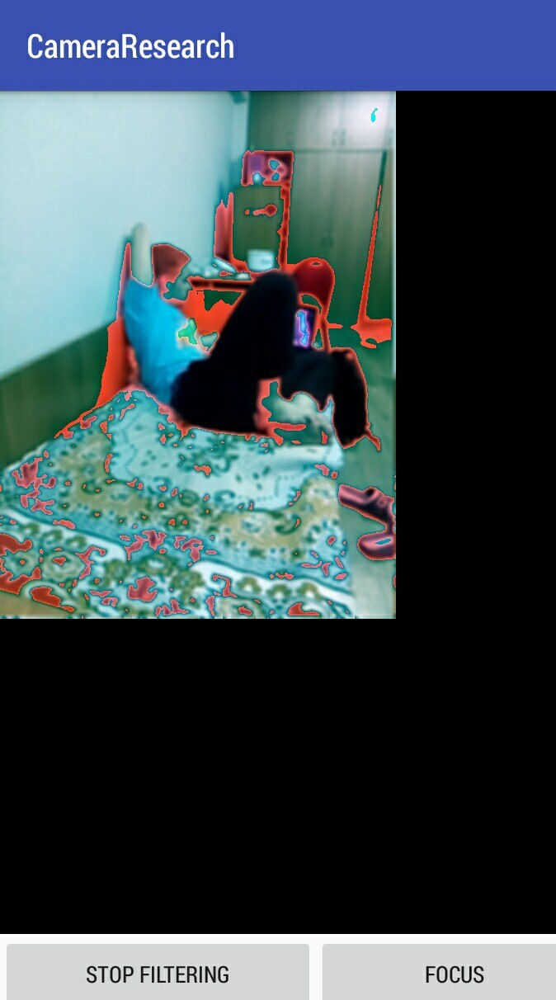

# AndroidOpenCL

Использование OpenCL на Android-устройствах для фильтрации изображения. Реализован фильр размытия. 

## Структура проекта (основные файлы)

* `build.gradle` — конфигурация сборки проекта
* `app/build.gradle` — конфигурация сборки приложения
* `app/CMakeLists.txt` — конфигурация сборки нативного С-кода 
* `app/src/main/assets/kernel.cl` — код ядер OpenCL
* `app/src/main/c` — код С для вызова ядра
* `app/src/main/java/com/kimentii/cameraresearch/*.java` — код Android-приложения

## Как запустить 

Для запуска необходимо:

1. Установить gradle + Android SDK с набором библиотек под целевую версию Android

2. Найти на устройстве библиотеку, реализующую OpenCL (если устройство реально его поддерживает). Скорее всего она находится в `/system/lib` или `/system/vendor/lib`. 

3. Выгрузить бибилиотеку себе на компьютер (откуда будет идти сборка)

4. Указать путь к этой библиотеке в `app/CMakeLists.txt`

5. Запустить сборку из корня проекта: `gradle build`

6. Забрать свой apk из `app/build/outputs/apk/debug/app-armeabi-v7a-debug.apk`

   ## Скрины

   Без фильтрации:

   

   С фильтрацией:

   

   Кроме фильтрации к красному каналу добавлено 50 пунктов: `new_red = (old_red + 50)% 255`

   